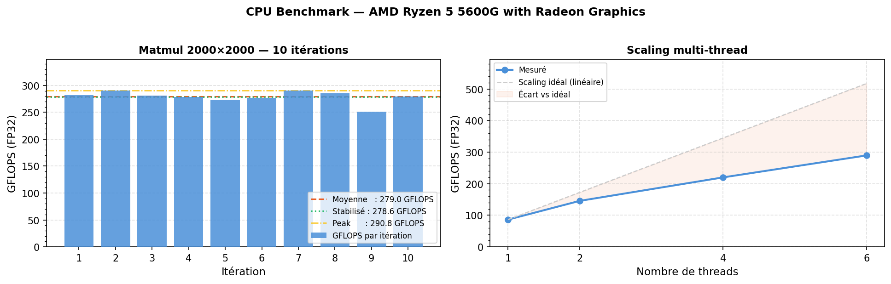
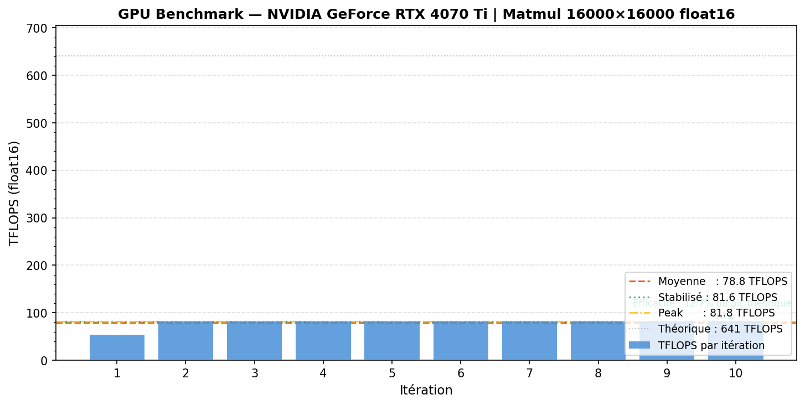
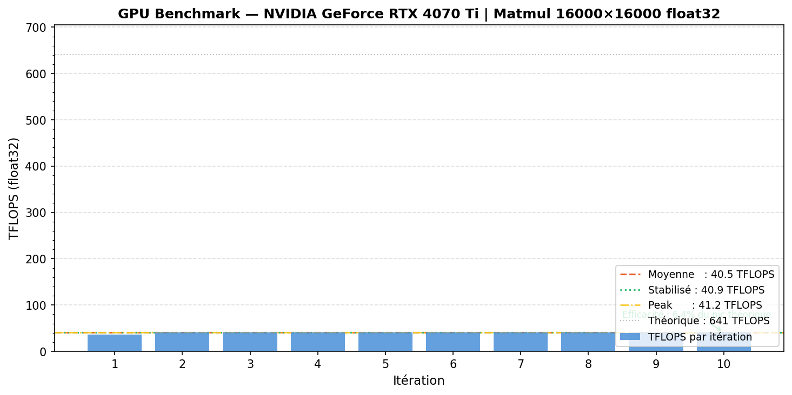
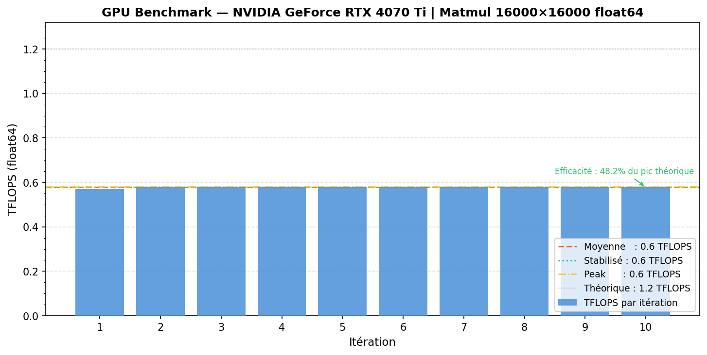

# <p align="center"> 🚀 Benchmark CPU & GPU (PyTorch)</p>

<p align="center">
  
  
  
  
  
</p>

Ce projet fournit des notebooks permettant de mesurer les performances de calcul (en GFLOPS / TFLOPS) sur CPU et GPU à l'aide d'opérations de multiplication de matrices avec différentes précisions (float16, float32, float64), ainsi qu'un **dashboard interactif Streamlit** pour visualiser les résultats.

---

## 📌 Objectifs

- Évaluer les performances réelles du matériel
- Comparer différentes précisions numériques (FP16, FP32, FP64)
- Mesurer l'écart avec les performances théoriques
- Visualiser la stabilité et l'efficacité des calculs
- Exporter les résultats en JSON pour les exploiter dans un dashboard

---

## 📂 Structure du projet

```
.
├── notebooks/
│   ├── CPU_Benchmark.ipynb           # Benchmark CPU (GFLOPS, scaling multi-thread)
│   └── GPU_Benchmark.ipynb           # Benchmark GPU (TFLOPS, FP16/FP32/FP64)
├── data/
│   ├── cpu_benchmark_results.json    # Résultats CPU exportés automatiquement
│   └── gpu_benchmark_results.json    # Résultats GPU exportés automatiquement
├── src/
│   ├── cpu_benchmark_result.png      # Graphique CPU
│   ├── benchmark_result_float16.png  # Graphique GPU FP16
│   ├── benchmark_result_float32.png  # Graphique GPU FP32
│   └── benchmark_result_float64.png  # Graphique GPU FP64
├── app.py                            # Dashboard interactif Streamlit
├── requirements.txt
└── README.md
```

> Les dossiers `data/` et `assets/` sont créés **automatiquement** à l'exécution des notebooks.

---

## ⚙️ Méthodologie

Le benchmark repose sur :

- Multiplications de matrices carrées (N × N)
- Plusieurs itérations de chauffe (*warmup*) puis de mesure
- Calcul des métriques suivantes :
  - GFLOPS / TFLOPS par itération
  - Moyenne globale
  - Moyenne stabilisée (iter 2+, warmup exclu)
  - Peak mesuré
- Scaling multi-thread (CPU uniquement)

---

## 🧪 Précisions testées

| Précision | CPU | GPU |
|---|---|---|
| `torch.float32` (FP32) | ✅ | ✅ (TF32 via Tensor Cores) |
| `torch.float64` (FP64) | ✅ | ✅ (limité sur GPU grand public) |
| `torch.float16` (FP16) | — | ✅ (Tensor Cores) |

---

## 📊 Résultats — Screenshots

### 🖥️ CPU Benchmark



### 🚀 GPU Benchmark — FP16



### 🚀 GPU Benchmark — FP32



### 🚀 GPU Benchmark — FP64



---

## 📡 Export des résultats

À la fin de chaque notebook, une cellule exporte automatiquement les résultats en JSON :

```
data/cpu_benchmark_results.json   →  gflops_history, thread_results, stats CPU…
data/gpu_benchmark_results.json   →  tflops_history par dtype, stats GPU…
```

Ces fichiers sont directement consommés par le **dashboard Streamlit**.

---

## 📈 Dashboard interactif

Le fichier `app.py` propose un dashboard complet basé sur **Streamlit + Plotly** :

- **Onglet CPU** : GFLOPS/itération, scaling multi-thread, temps par itération, infos système
- **Onglet GPU** : TFLOPS par dtype, jauges d'efficacité vs pic théorique, infos GPU
- **Onglet Comparaison** : bar chart CPU vs GPU, radar chart, tableau de speedup

### Lancer le dashboard

```bash
streamlit run app.py
```

> ⚠️ Les fichiers `data/cpu_benchmark_results.json` et `data/gpu_benchmark_results.json` doivent exister (générés par les notebooks).

---

## ▶️ Utilisation complète

### 1. Installer les dépendances

```bash
pip install torch matplotlib streamlit plotly pandas
```

### 2. Exécuter les notebooks

```bash
jupyter notebook
```

Ouvrir et exécuter dans l'ordre :

```
notebooks/CPU_Benchmark.ipynb
notebooks/GPU_Benchmark.ipynb
```

Les fichiers JSON et les graphiques PNG sont générés automatiquement dans `data/` et `src/`.

### 3. Lancer le dashboard

```bash
streamlit run app.py
```

---

## 🧠 Interprétation

- **FP16 / FP32 (Tensor Cores)** : très hautes performances sur GPU moderne grâce aux Tensor Cores
- **FP64** : performances fortement limitées sur GPU grand public (1/32 à 1/64 du FP32)
- **Efficacité** : mesure l'optimisation réelle vs la capacité théorique constructeur
- **Stable mean** : exclut la 1ère itération (cold start) pour une mesure plus fiable

---

## 🖥️ GPU cible (exemple)

Le notebook GPU inclut des références pour :

- **RTX 40xx** (architecture Ada Lovelace)

Pics théoriques (RTX 4070 Ti) :

| Précision | Théorique |
|---|---|
| FP16 / TF32 | ~641 TFLOPS |
| FP64 | ~1.2 TFLOPS |

---

## 📈 Personnalisation

Tu peux modifier dans les notebooks :

| Paramètre | Description |
|---|---|
| `MATRIX_SIZE` | Taille des matrices N×N |
| `BENCH_ITERS` | Nombre d'itérations de mesure |
| `WARMUP_ITERS` | Nombre d'itérations de chauffe |
| `DTYPE` | Type de données (CPU) |
| `allow_tf32` | Activation de TF32 (GPU) |

---

## ⚠️ Notes

- Les performances dépendent fortement du matériel, de la charge système et des optimisations CUDA
- Les premières itérations peuvent être moins représentatives (warmup)
- Le dashboard lit les pics théoriques GPU depuis la barre latérale (modifiables selon ta carte)

---

## 📜 Licence

Projet libre d'utilisation pour tests et recherche.
